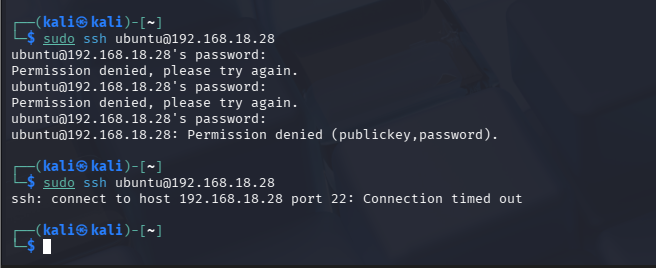
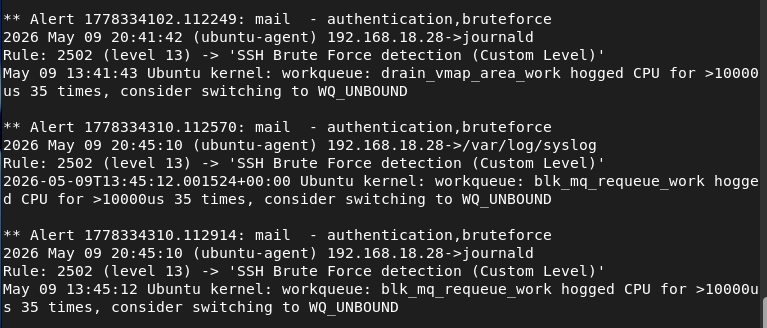

# Demo Lab Wazuh
This section demonstrates basic Wazuh SIEM operations including monitoring, rule configuration, and active response.

---

## SSH Brute Force Auto Blocking

### Mulipled Failed SSH Login by Attacker 

 
 

Attacker attack server wazuh agent

### Alert Trigger

 
 

Wazuh manager trigger alert and send Active response to Wazuh Agent

### IP Blocked by Agent

 
 

Wazuh Agent block attacker IP

---
