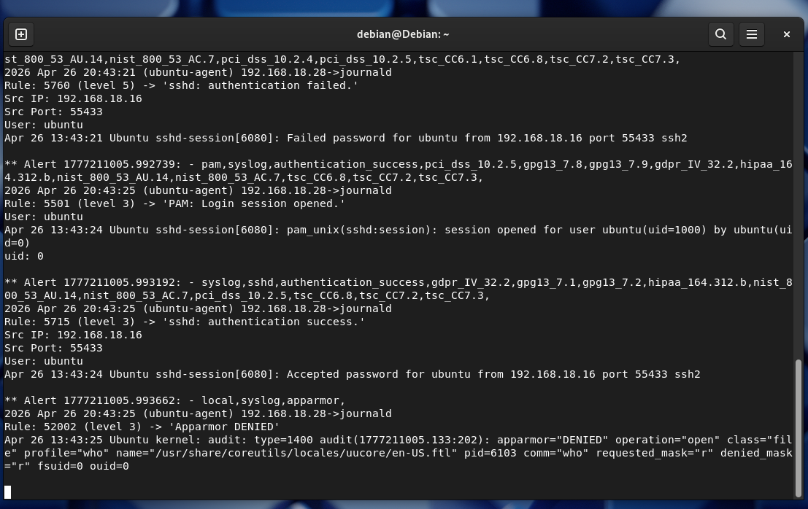

# SIEM Lab Setup With Wazuh

A hands-on SIEM lab project that detects SSH brute-force attacks and automatically blocks malicious IPs using Wazuh.

---

## Objective
To build a basic SIEM environment for:
- Log collection and monitoring
- Security event detection
- Simulating attack scenarios (future updates)

---

## Tools Used
- Wazuh (SIEM platform)
- Wazuh Agent (endpoint monitoring)
- Wazuh Server / Manager
- Agent Endpoint
- Virtual Lab Environment

---

## Architecture
See `/architecture` folder for full system diagram.

Flow:
Endpoint (Ubuntu) → Wazuh Agent → Wazuh Server (Debian) → Alerts & Log Analysis

---

## Key Features
- Real-time log monitoring
- SSH brute-force detection
- Automated IP blocking (active response)
- Centralized log analysis

---

## Current Status
🚧 Setup completed (Basic lab environment running).

Last updated: 3 Mei 2026

---

## Testing Simulator
Generate test events on Ubuntu:
```bash
sudo ls root
```
or failed SSH login simulation:
```bash
ssh fakeuser@localhost
```
Check alerts on debian: 
```bash
sudo tail -f /var/ossec/logs/alerts/alerts.log
```

---

## Future Improvements
- Integrate with OpenSearch for better visualization
- Add custom detection rules
- Implement alert notifications (Telegram / Email)

---

## Screenshots

- Wazuh Real-time Logs
<p align="center"> 
 
</p>

---

## Demo

- SSH brute-force simulation
- SIEM detection
- Automated IP blocking

More Screenshoot and walkthrough availabel in /demo

---

## Notes
This is a personal cybersecurity learning project for SOC/SIEM practice.
